<div align="left" style="position: relative;">
 
 <h1>DEANMACHINES-RSC</h1>
 <p align="left">
  <em><code>❯ Advanced AI-Powered Multi-Agent Platform for Intelligent Code Analysis & Automation</code></em>
 </p>
 <p align="left">
  <!-- Shields.io badges disabled, using skill icons. --></p>
 <p align="left">Built with the tools and technologies:</p>
 <p align="left">
  <a href="https://skillicons.dev">
  
 </a></p>
</div>
<br clear="right">

## Quick Links

- [Quick Links](#quick-links)
- [Overview](#overview)
- [Features](#features)
- [Project Structure](#project-structure)
- [Project Index](#project-index)
- [Getting Started](#getting-started)
- [Prerequisites](#prerequisites)
- [Installation](#installation)
- [Usage](#usage)
- [Testing](#testing)
- [Project Roadmap](#project-roadmap)
- [Contributing](#contributing)
- [License](#license)
- [Acknowledgments](#acknowledgments)

---

## Overview

Deanmachines-RSC is an advanced AI-powered application and research platform built with Next.js 15, TypeScript, and the Mastra AI framework. It features a modular, agent-based backend architecture that leverages autonomous agents, robust memory management, and Model Context Protocol (MCP) integration for intelligent code analysis, automation, and workflow orchestration. The system is designed for extensibility, observability (LangSmith, OpenTelemetry), and seamless integration with Google AI (Gemini) via the Vercel AI SDK. Key capabilities include multi-agent collaboration, dynamic tool execution, and advanced code graph generation for software repositories.

## 🏗️ Advanced Multi-Agent Architecture

```mermaid
graph TB
    User["👤 User<br>Next.js 15 Frontend"] -->|interacts with| Frontend["🎨 Frontend Layer<br>React 19, CopilotKit, Tailwind CSS"]
    
    Frontend -->|communicates with| Network["🕸️ AgentNetwork<br>LLM-based Dynamic Routing"]
    
    Network -->|coordinates| AgentLayer["🤖 Agent Layer (22+ Specialists)"]
    
    subgraph AgentLayer ["🤖 Specialized Agent Ecosystem"]
        subgraph DevAgents ["💻 Development Agents"]
            Master["👑 Master Agent<br>Central Orchestrator"]
            Code["⚡ Code Agent<br>Analysis & Generation"]
            Git["📚 Git Agent<br>Version Control"]
            Debug["🐛 Debug Agent<br>Error Detection"]
            Docs["📖 Documentation Agent<br>Technical Writing"]
        end
        
        subgraph DataAgents ["📊 Data & Analysis"]
            Data["📈 Data Agent<br>Processing & Analysis"]
            Graph["🕸️ Graph Agent<br>Knowledge Graphs"]
            Research["🔍 Research Agent<br>Information Gathering"]
            Weather["🌤️ Weather Agent<br>Forecasting"]
            Analyzer["🎯 Analyzer Agent<br>Pattern Recognition"]
        end
        
        subgraph OpsAgents ["⚙️ Operations & Management"]
            Manager["👔 Manager Agent<br>Project Coordination"]
            Marketing["📢 Marketing Agent<br>Content Creation"]
            Sysadmin["🔧 Sysadmin Agent<br>System Operations"]
            Browser["🌐 Browser Agent<br>Web Automation"]
            Docker["🐳 Docker Agent<br>Containerization"]
        end
        
        subgraph CreativeAgents ["🎨 Creative & Specialized"]
            Design["🎨 Design Agent<br>UI/UX Creation"]
            Special["⭐ Special Agent<br>Multi-domain Expert"]
            Strategizer["📋 Strategizer Agent<br>Planning & Strategy"]
            Supervisor["👁️ Supervisor Agent<br>Quality Assurance"]
            Evolve["🚀 Evolve Agent<br>Continuous Improvement"]
        end
    end
    
    AgentLayer -->|uses| Tools["🛠️ MCP Tools (67 Available)<br>Real Implementation, No Mocks"]
    AgentLayer -->|stores in| Memory["💾 Agent Memory<br>LibSQL/Turso + Vector Storage"]
    
    Tools -->|integrates with| External["🌐 External Services"]
    
    subgraph External ["🌐 External Integrations"]
        GitHub["📚 GitHub<br>Repository Management"]
        Google["🧠 Google AI<br>Gemini Models"]
        Supabase["🔐 Supabase<br>Auth & Database"]
        LangSmith["📊 LangSmith<br>AI Observability"]
    end
    
    Memory -->|traces to| LangSmith
    AgentLayer -->|powered by| Google
    Frontend -->|authenticates via| Supabase
    Tools -->|accesses| GitHub
    
    classDef userNode fill:#4ade80,stroke:#16a34a,color:#000
    classDef frontendNode fill:#06b6d4,stroke:#0891b2,color:#fff
    classDef networkNode fill:#8b5cf6,stroke:#7c3aed,color:#fff
    classDef agentNode fill:#f59e0b,stroke:#d97706,color:#000
    classDef toolNode fill:#ef4444,stroke:#dc2626,color:#fff
    classDef memoryNode fill:#ec4899,stroke:#db2777,color:#fff
    classDef externalNode fill:#6b7280,stroke:#4b5563,color:#fff
    
    class User userNode
    class Frontend frontendNode
    class Network networkNode
    class Master,Code,Git,Debug,Docs,Data,Graph,Research,Weather,Analyzer,Manager,Marketing,Sysadmin,Browser,Docker,Design,Special,Strategizer,Supervisor,Evolve agentNode
    class Tools toolNode
    class Memory memoryNode
    class GitHub,Google,Supabase,LangSmith externalNode
```



### 🎯 Architecture Highlights

- **🤖 22+ Specialized Agents**: Each with runtime context types for enhanced capabilities
- **🕸️ Dynamic Agent Routing**: LLM-based coordination through AgentNetwork
- **⚡ Real MCP Integration**: 67 available tools with no mock implementations
- **🎨 Modern Frontend**: Next.js 15, React 19, CopilotKit for seamless AI interaction
- **💾 Persistent Memory**: LibSQL/Turso with vector storage for agent context
- **📊 Full Observability**: LangSmith tracing and OpenTelemetry monitoring
- **🔐 Secure Authentication**: Supabase Auth with GitHub OAuth integration

---

## Feature

<code>
❯ **Mastra AI Framework**: Modular, type-safe agent and workflow system for orchestrating complex AI tasks and automations.
❯ **Autonomous Agents**: Specialized agents (e.g., gitAgent, codeAgent, graphAgent, dataAgent, supervisorAgent, analyzerAgent, designAgent) for code analysis, data processing, graph generation, and more.
❯ **Code Graph Maker Workflows**: Analyze GitHub repositories and generate multi-format (SVG, HTML, JSON) code dependency graphs using real MCP tools and agent coordination.
❯ **MCP Integration**: Full support for Model Context Protocol for advanced AI-driven code understanding and tool interoperability.
❯ **Google AI (Gemini) via Vercel AI SDK**: Primary AI provider for all intelligent operations, ensuring state-of-the-art model performance.
❯ **Persistent Storage**: LibSQL/Turso for structured and vector data, supporting agent memory and semantic search.
❯ **Observability**: Integrated tracing (OpenTelemetry, LangSmith) and logging (PinoLogger) for robust monitoring and debugging.
❯ **Frontend**: Next.js 15, React 19, and Tailwind CSS for a modern, responsive UI and seamless agent interaction.
❯ **Security & Validation**: Zod schemas for rigorous input/output validation, secure environment variable management, and best-practice error handling throughout.
❯ **Extensible Tooling**: Easily add new tools and agents following strict project patterns and validation standards.
</code>

---

## Project Structure

```sh
└── Deanmachines-RSC/
    ├── .github
    │   ├── instructions
    │   │   └── .instructions.md
    │   └── prompts
    │       └── .prompt.md
    ├── CHANGELOG.md
    ├── README.md
    ├── auth.ts
    ├── components.json
    ├── eslint.config.mjs
    ├── globalSetup.ts
    ├── next.config.ts
    ├── package-lock.json
    ├── package.json
    ├── postcss.config.mjs
    ├── public
    │   ├── file.svg
    │   ├── globe.svg
    │   ├── next.svg
    │   ├── vercel.svg
    │   └── window.svg
    ├── src
    │   ├── app
    │   │   ├── api
    │   │   │   └── auth
    │   │   │       └── [...nextauth]
    │   │   ├── favicon.ico
    │   │   ├── globals.css
    │   │   ├── layout.tsx
    │   │   ├── page.tsx
    │   │   └── test
    │   │       ├── action.ts
    │   │       ├── form.tsx
    │   │       └── page.tsx
    │   ├── components
    │   │   └── ui
    │   │       ├── accordion.tsx
    │   │       ├── alert-dialog.tsx
    │   │       ├── alert.tsx
    │   │       ├── aspect-ratio.tsx
    │   │       ├── avatar.tsx
    │   │       ├── badge.tsx
    │   │       ├── breadcrumb.tsx
    │   │       ├── button.tsx
    │   │       ├── calendar.tsx
    │   │       ├── card.tsx
    │   │       ├── carousel.tsx
    │   │       ├── chart.tsx
    │   │       ├── checkbox.tsx
    │   │       ├── collapsible.tsx
    │   │       ├── command.tsx
    │   │       ├── context-menu.tsx
    │   │       ├── dialog.tsx
    │   │       ├── drawer.tsx
    │   │       ├── dropdown-menu.tsx
    │   │       ├── form.tsx
    │   │       ├── hover-card.tsx
    │   │       ├── input-otp.tsx
    │   │       ├── input.tsx
    │   │       ├── label.tsx
    │   │       ├── menubar.tsx
    │   │       ├── navigation-menu.tsx
    │   │       ├── pagination.tsx
    │   │       ├── popover.tsx
    │   │       ├── progress.tsx
    │   │       ├── radio-group.tsx
    │   │       ├── resizable.tsx
    │   │       ├── scroll-area.tsx
    │   │       ├── select.tsx
    │   │       ├── separator.tsx
    │   │       ├── sheet.tsx
    │   │       ├── sidebar.tsx
    │   │       ├── skeleton.tsx
    │   │       ├── slider.tsx
    │   │       ├── sonner.tsx
    │   │       ├── switch.tsx
    │   │       ├── table.tsx
    │   │       ├── tabs.tsx
    │   │       ├── textarea.tsx
    │   │       ├── toggle-group.tsx
    │   │       ├── toggle.tsx
    │   │       └── tooltip.tsx
    │   ├── hooks
    │   │   └── use-mobile.ts
    │   ├── lib
    │   │   └── utils.ts
    │   └── mastra
    │       ├── agentMemory.ts
    │       ├── agents
    │       │   ├── browser-agent.ts
    │       │   ├── code-agent.ts
    │       │   ├── data-agent.ts
    │       │   ├── debug-agent.ts
    │       │   ├── design-agent.ts
    │       │   ├── docker-agent.ts
    │       │   ├── documentation-agent.ts
    │       │   ├── git-agent.ts
    │       │   ├── graph-agent.ts
    │       │   ├── index.test.ts
    │       │   ├── index.ts
    │       │   ├── manager-agent.ts
    │       │   ├── marketing-agent.ts
    │       │   ├── master-agent.ts
    │       │   ├── processing-agent.ts
    │       │   ├── research-agent.ts
    │       │   ├── special-agent.ts
    │       │   ├── supervisor-agent.ts
    │       │   ├── sysadmin-agent.ts
    │       │   ├── utility-agent.ts
    │       │   └── weather-agent.ts
    │       ├── config
    │       │   ├── environment.ts
    │       │   ├── googleProvider.ts
    │       │   └── index.ts
    │       ├── index.ts
    │       ├── tools
    │       │   ├── graphRAG.ts
    │       │   ├── mcp.ts
    │       │   ├── stock-tools.ts
    │       │   ├── vectorQueryTool.ts
    │       │   └── weather-tool.ts
    │       └── workflows
    │           └── weather-workflow.ts
    ├── testSetup.ts
    ├── tsconfig.json
    └── vitest.config.ts
```

### Project Index

<details open>
 <summary><b><code>DEANMACHINES-RSC/</code></b></summary>
 <details> <!-- __root__ Submodule -->
  <summary><b>__root__</b></summary>
  <blockquote>
   <table>
   <tr>
    <td><b><a href='https://github.com/ssdeanx/Deanmachines-RSC/blob/master/testSetup.ts'>testSetup.ts</a></b></td>
    <td><code>❯ Vitest global test setup configuration for DOM environment and test utilities</code></td>
   </tr>
   <tr>
    <td><b><a href='https://github.com/ssdeanx/Deanmachines-RSC/blob/master/package-lock.json'>package-lock.json</a></b></td>
    <td><code>❯ NPM dependency lock file ensuring consistent package versions across environments</code></td>
   </tr>
   <tr>
    <td><b><a href='https://github.com/ssdeanx/Deanmachines-RSC/blob/master/next.config.ts'>next.config.ts</a></b></td>
    <td><code>❯ Next.js 15 configuration with server external packages for Mastra, AI SDK, and MCP tools</code></td>
   </tr>
   <tr>
    <td><b><a href='https://github.com/ssdeanx/Deanmachines-RSC/blob/master/tsconfig.json'>tsconfig.json</a></b></td>
    <td><code>❯ TypeScript configuration with ES2017 target, strict mode, and path aliases for @/* imports</code></td>
   </tr>
   <tr>
    <td><b><a href='https://github.com/ssdeanx/Deanmachines-RSC/blob/master/eslint.config.mjs'>eslint.config.mjs</a></b></td>
    <td><code>❯ ESLint configuration with Next.js rules, TypeScript support, and code quality standards</code></td>
   </tr>
   <tr>
    <td><b><a href='https://github.com/ssdeanx/Deanmachines-RSC/blob/master/globalSetup.ts'>globalSetup.ts</a></b></td>
    <td><code>❯ Global test setup for Vitest with environment configuration and test utilities</code></td>
   </tr>
   <tr>
    <td><b><a href='https://github.com/ssdeanx/Deanmachines-RSC/blob/master/postcss.config.mjs'>postcss.config.mjs</a></b></td>
    <td><code>❯ PostCSS configuration for Tailwind CSS processing and optimization</code></td>
   </tr>
   <tr>
    <td><b><a href='https://github.com/ssdeanx/Deanmachines-RSC/blob/master/vitest.config.ts'>vitest.config.ts</a></b></td>
    <td><code>❯ Vitest testing framework configuration with TypeScript support and test environment setup</code></td>
   </tr>
   <tr>
    <td><b><a href='https://github.com/ssdeanx/Deanmachines-RSC/blob/master/package.json'>package.json</a></b></td>
    <td><code>❯ Project manifest with dependencies, scripts, and metadata for the AI-powered platform</code></td>
   </tr>
   <tr>
    <td><b><a href='https://github.com/ssdeanx/Deanmachines-RSC/blob/master/auth.ts'>auth.ts</a></b></td>
    <td><code>❯ NextAuth v5 configuration with Google/GitHub OAuth providers and session management</code></td>
   </tr>
   <tr>
    <td><b><a href='https://github.com/ssdeanx/Deanmachines-RSC/blob/master/components.json'>components.json</a></b></td>
    <td><code>❯ Shadcn/ui component library configuration with Tailwind CSS and component aliases</code></td>
   </tr>
   </table>
  </blockquote>
 </details>
 <details> <!-- src Submodule -->
  <summary><b>src</b></summary>
  <blockquote>
   <details>
    <summary><b>lib</b></summary>
    <blockquote>
     <table>
     <tr>
      <td><b><a href='https://github.com/ssdeanx/Deanmachines-RSC/blob/master/src/lib/utils.ts'>utils.ts</a></b></td>
      <td><code>❯ Utility functions including Tailwind CSS class merging with clsx and tailwind-merge</code></td>
     </tr>
     </table>
    </blockquote>
   </details>
   <details>
    <summary><b>components</b></summary>
    <blockquote>
     <details>
      <summary><b>ui</b></summary>
      <blockquote>
       <table>
       <tr>
        <td><b><a href='https://github.com/ssdeanx/Deanmachines-RSC/blob/master/src/components/ui/context-menu.tsx'>context-menu.tsx</a></b></td>
        <td><code>❯ REPLACE-ME</code></td>
       </tr>
       <tr>
        <td><b><a href='https://github.com/ssdeanx/Deanmachines-RSC/blob/master/src/components/ui/accordion.tsx'>accordion.tsx</a></b></td>
        <td><code>❯ REPLACE-ME</code></td>
       </tr>
       <tr>
        <td><b><a href='https://github.com/ssdeanx/Deanmachines-RSC/blob/master/src/components/ui/alert-dialog.tsx'>alert-dialog.tsx</a></b></td>
        <td><code>❯ REPLACE-ME</code></td>
       </tr>
       <tr>
        <td><b><a href='https://github.com/ssdeanx/Deanmachines-RSC/blob/master/src/components/ui/radio-group.tsx'>radio-group.tsx</a></b></td>
        <td><code>❯ REPLACE-ME</code></td>
       </tr>
       <tr>
        <td><b><a href='https://github.com/ssdeanx/Deanmachines-RSC/blob/master/src/components/ui/checkbox.tsx'>checkbox.tsx</a></b></td>
        <td><code>❯ REPLACE-ME</code></td>
       </tr>
       <tr>
        <td><b><a href='https://github.com/ssdeanx/Deanmachines-RSC/blob/master/src/components/ui/input-otp.tsx'>input-otp.tsx</a></b></td>
        <td><code>❯ REPLACE-ME</code></td>
       </tr>
       <tr>
        <td><b><a href='https://github.com/ssdeanx/Deanmachines-RSC/blob/master/src/components/ui/sheet.tsx'>sheet.tsx</a></b></td>
        <td><code>❯ REPLACE-ME</code></td>
       </tr>
       <tr>
        <td><b><a href='https://github.com/ssdeanx/Deanmachines-RSC/blob/master/src/components/ui/progress.tsx'>progress.tsx</a></b></td>
        <td><code>❯ REPLACE-ME</code></td>
       </tr>
       <tr>
        <td><b><a href='https://github.com/ssdeanx/Deanmachines-RSC/blob/master/src/components/ui/badge.tsx'>badge.tsx</a></b></td>
        <td><code>❯ REPLACE-ME</code></td>
       </tr>
       <tr>
        <td><b><a href='https://github.com/ssdeanx/Deanmachines-RSC/blob/master/src/components/ui/breadcrumb.tsx'>breadcrumb.tsx</a></b></td>
        <td><code>❯ REPLACE-ME</code></td>
       </tr>
       <tr>
        <td><b><a href='https://github.com/ssdeanx/Deanmachines-RSC/blob/master/src/components/ui/sidebar.tsx'>sidebar.tsx</a></b></td>
        <td><code>❯ REPLACE-ME</code></td>
       </tr>
       <tr>
        <td><b><a href='https://github.com/ssdeanx/Deanmachines-RSC/blob/master/src/components/ui/pagination.tsx'>pagination.tsx</a></b></td>
        <td><code>❯ REPLACE-ME</code></td>
       </tr>
       <tr>
        <td><b><a href='https://github.com/ssdeanx/Deanmachines-RSC/blob/master/src/components/ui/label.tsx'>label.tsx</a></b></td>
        <td><code>❯ REPLACE-ME</code></td>
       </tr>
       <tr>
        <td><b><a href='https://github.com/ssdeanx/Deanmachines-RSC/blob/master/src/components/ui/scroll-area.tsx'>scroll-area.tsx</a></b></td>
        <td><code>❯ REPLACE-ME</code></td>
       </tr>
       <tr>
        <td><b><a href='https://github.com/ssdeanx/Deanmachines-RSC/blob/master/src/components/ui/input.tsx'>input.tsx</a></b></td>
        <td><code>❯ REPLACE-ME</code></td>
       </tr>
       <tr>
        <td><b><a href='https://github.com/ssdeanx/Deanmachines-RSC/blob/master/src/components/ui/textarea.tsx'>textarea.tsx</a></b></td>
        <td><code>❯ REPLACE-ME</code></td>
       </tr>
       <tr>
        <td><b><a href='https://github.com/ssdeanx/Deanmachines-RSC/blob/master/src/components/ui/separator.tsx'>separator.tsx</a></b></td>
        <td><code>❯ REPLACE-ME</code></td>
       </tr>
       <tr>
        <td><b><a href='https://github.com/ssdeanx/Deanmachines-RSC/blob/master/src/components/ui/toggle-group.tsx'>toggle-group.tsx</a></b></td>
        <td><code>❯ REPLACE-ME</code></td>
       </tr>
       <tr>
        <td><b><a href='https://github.com/ssdeanx/Deanmachines-RSC/blob/master/src/components/ui/command.tsx'>command.tsx</a></b></td>
        <td><code>❯ REPLACE-ME</code></td>
       </tr>
       <tr>
        <td><b><a href='https://github.com/ssdeanx/Deanmachines-RSC/blob/master/src/components/ui/popover.tsx'>popover.tsx</a></b></td>
        <td><code>❯ REPLACE-ME</code></td>
       </tr>
       <tr>
        <td><b><a href='https://github.com/ssdeanx/Deanmachines-RSC/blob/master/src/components/ui/slider.tsx'>slider.tsx</a></b></td>
        <td><code>❯ REPLACE-ME</code></td>
       </tr>
       <tr>
        <td><b><a href='https://github.com/ssdeanx/Deanmachines-RSC/blob/master/src/components/ui/form.tsx'>form.tsx</a></b></td>
        <td><code>❯ REPLACE-ME</code></td>
       </tr>
       <tr>
        <td><b><a href='https://github.com/ssdeanx/Deanmachines-RSC/blob/master/src/components/ui/select.tsx'>select.tsx</a></b></td>
        <td><code>❯ REPLACE-ME</code></td>
       </tr>
       <tr>
        <td><b><a href='https://github.com/ssdeanx/Deanmachines-RSC/blob/master/src/components/ui/button.tsx'>button.tsx</a></b></td>
        <td><code>❯ REPLACE-ME</code></td>
       </tr>
       <tr>
        <td><b><a href='https://github.com/ssdeanx/Deanmachines-RSC/blob/master/src/components/ui/drawer.tsx'>drawer.tsx</a></b></td>
        <td><code>❯ REPLACE-ME</code></td>
       </tr>
       <tr>
        <td><b><a href='https://github.com/ssdeanx/Deanmachines-RSC/blob/master/src/components/ui/toggle.tsx'>toggle.tsx</a></b></td>
        <td><code>❯ REPLACE-ME</code></td>
       </tr>
       <tr>
        <td><b><a href='https://github.com/ssdeanx/Deanmachines-RSC/blob/master/src/components/ui/dialog.tsx'>dialog.tsx</a></b></td>
        <td><code>❯ REPLACE-ME</code></td>
       </tr>
       <tr>
        <td><b><a href='https://github.com/ssdeanx/Deanmachines-RSC/blob/master/src/components/ui/alert.tsx'>alert.tsx</a></b></td>
        <td><code>❯ REPLACE-ME</code></td>
       </tr>
       <tr>
        <td><b><a href='https://github.com/ssdeanx/Deanmachines-RSC/blob/master/src/components/ui/carousel.tsx'>carousel.tsx</a></b></td>
        <td><code>❯ REPLACE-ME</code></td>
       </tr>
       <tr>
        <td><b><a href='https://github.com/ssdeanx/Deanmachines-RSC/blob/master/src/components/ui/navigation-menu.tsx'>navigation-menu.tsx</a></b></td>
        <td><code>❯ REPLACE-ME</code></td>
       </tr>
       <tr>
        <td><b><a href='https://github.com/ssdeanx/Deanmachines-RSC/blob/master/src/components/ui/table.tsx'>table.tsx</a></b></td>
        <td><code>❯ REPLACE-ME</code></td>
       </tr>
       <tr>
        <td><b><a href='https://github.com/ssdeanx/Deanmachines-RSC/blob/master/src/components/ui/tabs.tsx'>tabs.tsx</a></b></td>
        <td><code>❯ REPLACE-ME</code></td>
       </tr>
       <tr>
        <td><b><a href='https://github.com/ssdeanx/Deanmachines-RSC/blob/master/src/components/ui/skeleton.tsx'>skeleton.tsx</a></b></td>
        <td><code>❯ REPLACE-ME</code></td>
       </tr>
       <tr>
        <td><b><a href='https://github.com/ssdeanx/Deanmachines-RSC/blob/master/src/components/ui/switch.tsx'>switch.tsx</a></b></td>
        <td><code>❯ REPLACE-ME</code></td>
       </tr>
       <tr>
        <td><b><a href='https://github.com/ssdeanx/Deanmachines-RSC/blob/master/src/components/ui/dropdown-menu.tsx'>dropdown-menu.tsx</a></b></td>
        <td><code>❯ REPLACE-ME</code></td>
       </tr>
       <tr>
        <td><b><a href='https://github.com/ssdeanx/Deanmachines-RSC/blob/master/src/components/ui/collapsible.tsx'>collapsible.tsx</a></b></td>
        <td><code>❯ REPLACE-ME</code></td>
       </tr>
       <tr>
        <td><b><a href='https://github.com/ssdeanx/Deanmachines-RSC/blob/master/src/components/ui/menubar.tsx'>menubar.tsx</a></b></td>
        <td><code>❯ REPLACE-ME</code></td>
       </tr>
       <tr>
        <td><b><a href='https://github.com/ssdeanx/Deanmachines-RSC/blob/master/src/components/ui/resizable.tsx'>resizable.tsx</a></b></td>
        <td><code>❯ REPLACE-ME</code></td>
       </tr>
       <tr>
        <td><b><a href='https://github.com/ssdeanx/Deanmachines-RSC/blob/master/src/components/ui/chart.tsx'>chart.tsx</a></b></td>
        <td><code>❯ REPLACE-ME</code></td>
       </tr>
       <tr>
        <td><b><a href='https://github.com/ssdeanx/Deanmachines-RSC/blob/master/src/components/ui/avatar.tsx'>avatar.tsx</a></b></td>
        <td><code>❯ REPLACE-ME</code></td>
       </tr>
       <tr>
        <td><b><a href='https://github.com/ssdeanx/Deanmachines-RSC/blob/master/src/components/ui/hover-card.tsx'>hover-card.tsx</a></b></td>
        <td><code>❯ REPLACE-ME</code></td>
       </tr>
       <tr>
        <td><b><a href='https://github.com/ssdeanx/Deanmachines-RSC/blob/master/src/components/ui/aspect-ratio.tsx'>aspect-ratio.tsx</a></b></td>
        <td><code>❯ REPLACE-ME</code></td>
       </tr>
       <tr>
        <td><b><a href='https://github.com/ssdeanx/Deanmachines-RSC/blob/master/src/components/ui/calendar.tsx'>calendar.tsx</a></b></td>
        <td><code>❯ REPLACE-ME</code></td>
       </tr>
       <tr>
        <td><b><a href='https://github.com/ssdeanx/Deanmachines-RSC/blob/master/src/components/ui/tooltip.tsx'>tooltip.tsx</a></b></td>
        <td><code>❯ REPLACE-ME</code></td>
       </tr>
       <tr>
        <td><b><a href='https://github.com/ssdeanx/Deanmachines-RSC/blob/master/src/components/ui/sonner.tsx'>sonner.tsx</a></b></td>
        <td><code>❯ REPLACE-ME</code></td>
       </tr>
       <tr>
        <td><b><a href='https://github.com/ssdeanx/Deanmachines-RSC/blob/master/src/components/ui/card.tsx'>card.tsx</a></b></td>
        <td><code>❯ REPLACE-ME</code></td>
       </tr>
       </table>
      </blockquote>
     </details>
    </blockquote>
   </details>
   <details>
    <summary><b>hooks</b></summary>
    <blockquote>
     <table>
     <tr>
      <td><b><a href='https://github.com/ssdeanx/Deanmachines-RSC/blob/master/src/hooks/use-mobile.ts'>use-mobile.ts</a></b></td>
      <td><code>❯ React hook for detecting mobile devices and responsive breakpoints</code></td>
     </tr>
     </table>
    </blockquote>
   </details>
   <details>
    <summary><b>mastra</b></summary>
    <blockquote>
     <table>
     <tr>
      <td><b><a href='https://github.com/ssdeanx/Deanmachines-RSC/blob/master/src/mastra/index.ts'>index.ts</a></b></td>
      <td><code>❯ Main Mastra instance with agent registry, workflows, CopilotKit integration, and observability</code></td>
     </tr>
     <tr>
      <td><b><a href='https://github.com/ssdeanx/Deanmachines-RSC/blob/master/src/mastra/agentMemory.ts'>agentMemory.ts</a></b></td>
      <td><code>❯ Shared memory system for agents using LibSQL/Turso with vector storage capabilities</code></td>
     </tr>
     </table>
     <details>
      <summary><b>config</b></summary>
      <blockquote>
       <table>
       <tr>
        <td><b><a href='https://github.com/ssdeanx/Deanmachines-RSC/blob/master/src/mastra/config/environment.ts'>environment.ts</a></b></td>
        <td><code>❯ Environment variable validation with Zod schemas for API keys and configuration</code></td>
       </tr>
       <tr>
        <td><b><a href='https://github.com/ssdeanx/Deanmachines-RSC/blob/master/src/mastra/config/index.ts'>index.ts</a></b></td>
        <td><code>❯ LangSmith observability configuration with AI SDK telemetry and tracing integration</code></td>
       </tr>
       <tr>
        <td><b><a href='https://github.com/ssdeanx/Deanmachines-RSC/blob/master/src/mastra/config/googleProvider.ts'>googleProvider.ts</a></b></td>
        <td><code>❯ Google AI (Gemini) provider configuration with thinking models and enhanced capabilities</code></td>
       </tr>
       </table>
      </blockquote>
     </details>
     <details>
      <summary><b>agents</b></summary>
      <blockquote>
       <table>
       <tr>
        <td><b><a href='https://github.com/ssdeanx/Deanmachines-RSC/blob/master/src/mastra/agents/master-agent.ts'>master-agent.ts</a></b></td>
        <td><code>❯ Primary debugging and problem-solving agent with comprehensive tool access and runtime context</code></td>
       </tr>
       <tr>
        <td><b><a href='https://github.com/ssdeanx/Deanmachines-RSC/blob/master/src/mastra/agents/documentation-agent.ts'>documentation-agent.ts</a></b></td>
        <td><code>❯ Specialized agent for generating and maintaining technical documentation</code></td>
       </tr>
       <tr>
        <td><b><a href='https://github.com/ssdeanx/Deanmachines-RSC/blob/master/src/mastra/agents/marketing-agent.ts'>marketing-agent.ts</a></b></td>
        <td><code>❯ Marketing content creation and strategy agent for promotional materials</code></td>
       </tr>
       <tr>
        <td><b><a href='https://github.com/ssdeanx/Deanmachines-RSC/blob/master/src/mastra/agents/data-agent.ts'>data-agent.ts</a></b></td>
        <td><code>❯ Data analysis and processing agent with vector search and analytics capabilities</code></td>
       </tr>
       <tr>
        <td><b><a href='https://github.com/ssdeanx/Deanmachines-RSC/blob/master/src/mastra/agents/debug-agent.ts'>debug-agent.ts</a></b></td>
        <td><code>❯ Debugging specialist agent for troubleshooting and error resolution</code></td>
       </tr>
       <tr>
        <td><b><a href='https://github.com/ssdeanx/Deanmachines-RSC/blob/master/src/mastra/agents/browser-agent.ts'>browser-agent.ts</a></b></td>
        <td><code>❯ Web automation agent with Playwright integration for browser interactions</code></td>
       </tr>
       <tr>
        <td><b><a href='https://github.com/ssdeanx/Deanmachines-RSC/blob/master/src/mastra/agents/utility-agent.ts'>utility-agent.ts</a></b></td>
        <td><code>❯ General-purpose utility agent for miscellaneous tasks and helper functions</code></td>
       </tr>
       <tr>
        <td><b><a href='https://github.com/ssdeanx/Deanmachines-RSC/blob/master/src/mastra/agents/docker-agent.ts'>docker-agent.ts</a></b></td>
        <td><code>❯ Container management agent for Docker operations and deployment tasks</code></td>
       </tr>
       <tr>
        <td><b><a href='https://github.com/ssdeanx/Deanmachines-RSC/blob/master/src/mastra/agents/special-agent.ts'>special-agent.ts</a></b></td>
        <td><code>❯ Multi-domain expert agent for specialized and complex problem-solving tasks</code></td>
       </tr>
       <tr>
        <td><b><a href='https://github.com/ssdeanx/Deanmachines-RSC/blob/master/src/mastra/agents/graph-agent.ts'>graph-agent.ts</a></b></td>
        <td><code>❯ Knowledge graph analysis agent for relationship mapping and graph operations</code></td>
       </tr>
       <tr>
        <td><b><a href='https://github.com/ssdeanx/Deanmachines-RSC/blob/master/src/mastra/agents/weather-agent.ts'>weather-agent.ts</a></b></td>
        <td><code>❯ Weather information agent with API integration and forecast capabilities</code></td>
       </tr>
       <tr>
        <td><b><a href='https://github.com/ssdeanx/Deanmachines-RSC/blob/master/src/mastra/agents/supervisor-agent.ts'>supervisor-agent.ts</a></b></td>
        <td><code>❯ Agent coordination and orchestration specialist for multi-agent workflows</code></td>
       </tr>
       <tr>
        <td><b><a href='https://github.com/ssdeanx/Deanmachines-RSC/blob/master/src/mastra/agents/code-agent.ts'>code-agent.ts</a></b></td>
        <td><code>❯ Code analysis and generation agent with programming language expertise</code></td>
       </tr>
       <tr>
        <td><b><a href='https://github.com/ssdeanx/Deanmachines-RSC/blob/master/src/mastra/agents/processing-agent.ts'>processing-agent.ts</a></b></td>
        <td><code>❯ Data processing and transformation agent for complex computational tasks</code></td>
       </tr>
       <tr>
        <td><b><a href='https://github.com/ssdeanx/Deanmachines-RSC/blob/master/src/mastra/agents/index.ts'>index.ts</a></b></td>
        <td><code>❯ Agent registry barrel file with categorized exports and metadata for all agents</code></td>
       </tr>
       <tr>
        <td><b><a href='https://github.com/ssdeanx/Deanmachines-RSC/blob/master/src/mastra/agents/manager-agent.ts'>manager-agent.ts</a></b></td>
        <td><code>❯ Project management agent for task coordination and workflow management</code></td>
       </tr>
       <tr>
        <td><b><a href='https://github.com/ssdeanx/Deanmachines-RSC/blob/master/src/mastra/agents/sysadmin-agent.ts'>sysadmin-agent.ts</a></b></td>
        <td><code>❯ System administration agent for infrastructure and deployment operations</code></td>
       </tr>
       <tr>
        <td><b><a href='https://github.com/ssdeanx/Deanmachines-RSC/blob/master/src/mastra/agents/git-agent.ts'>git-agent.ts</a></b></td>
        <td><code>❯ Git operations agent for version control and repository management</code></td>
       </tr>
       <tr>
        <td><b><a href='https://github.com/ssdeanx/Deanmachines-RSC/blob/master/src/mastra/agents/design-agent.ts'>design-agent.ts</a></b></td>
        <td><code>❯ UI/UX design agent for interface design and user experience optimization</code></td>
       </tr>
       <tr>
        <td><b><a href='https://github.com/ssdeanx/Deanmachines-RSC/blob/master/src/mastra/agents/index.test.ts'>index.test.ts</a></b></td>
        <td><code>❯ Comprehensive test suite for agent registry and agent functionality validation</code></td>
       </tr>
       <tr>
        <td><b><a href='https://github.com/ssdeanx/Deanmachines-RSC/blob/master/src/mastra/agents/research-agent.ts'>research-agent.ts</a></b></td>
        <td><code>❯ Research and information gathering agent with web search and analysis capabilities</code></td>
       </tr>
       </table>
      </blockquote>
     </details>
     <details>
      <summary><b>workflows</b></summary>
      <blockquote>
       <table>
       <tr>
        <td><b><a href='https://github.com/ssdeanx/Deanmachines-RSC/blob/master/src/mastra/workflows/weather-workflow.ts'>weather-workflow.ts</a></b></td>
        <td><code>❯ Weather data processing workflow with API integration and data transformation</code></td>
       </tr>
       </table>
      </blockquote>
     </details>
    </blockquote>
   </details>
   <details>
    <summary><b>app</b></summary>
    <blockquote>
     <table>
     <tr>
      <td><b><a href='https://github.com/ssdeanx/Deanmachines-RSC/blob/master/src/app/layout.tsx'>layout.tsx</a></b></td>
      <td><code>❯ Root layout with NextAuth SessionProvider, ThemeProvider, and global styling</code></td>
     </tr>
     <tr>
      <td><b><a href='https://github.com/ssdeanx/Deanmachines-RSC/blob/master/src/app/globals.css'>globals.css</a></b></td>
      <td><code>❯ Global CSS with Tailwind directives, custom animations, and cutting-edge effects</code></td>
     </tr>
     <tr>
      <td><b><a href='https://github.com/ssdeanx/Deanmachines-RSC/blob/master/src/app/page.tsx'>page.tsx</a></b></td>
      <td><code>❯ Landing page with lightning effects, glassmorphism, and modern AI-themed design</code></td>
     </tr>
     </table>
     <details>
      <summary><b>test</b></summary>
      <blockquote>
       <table>
       <tr>
        <td><b><a href='https://github.com/ssdeanx/Deanmachines-RSC/blob/master/src/app/test/action.ts'>action.ts</a></b></td>
        <td><code>❯ REPLACE-ME</code></td>
       </tr>
       <tr>
        <td><b><a href='https://github.com/ssdeanx/Deanmachines-RSC/blob/master/src/app/test/page.tsx'>page.tsx</a></b></td>
        <td><code>❯ REPLACE-ME</code></td>
       </tr>
       <tr>
        <td><b><a href='https://github.com/ssdeanx/Deanmachines-RSC/blob/master/src/app/test/form.tsx'>form.tsx</a></b></td>
        <td><code>❯ REPLACE-ME</code></td>
       </tr>
       </table>
      </blockquote>
     </details>
     <details>
      <summary><b>api</b></summary>
      <blockquote>
       <details>
        <summary><b>auth</b></summary>
        <blockquote>
         <details>
          <summary><b>[...nextauth]</b></summary>
          <blockquote>
           <table>
           <tr>
            <td><b><a href='https://github.com/ssdeanx/Deanmachines-RSC/blob/master/src/app/api/auth/[...nextauth]/route.ts'>route.ts</a></b></td>
            <td><code>❯ NextAuth v5 API route handlers for OAuth authentication with GitHub and Google</code></td>
           </tr>
           </table>
          </blockquote>
         </details>
        </blockquote>
       </details>
      </blockquote>
     </details>
    </blockquote>
   </details>
  </blockquote>
 </details>
</details>

---

## Getting Started

### Prerequisites

Before getting started with Deanmachines-RSC, ensure your runtime environment meets the following requirements:

- **Programming Language:** TypeScript
- **Package Manager:** Npm

### Installation

Install Deanmachines-RSC using one of the following methods:

**Build from source:**

1. Clone the Deanmachines-RSC repository:

```sh
❯ git clone https://github.com/ssdeanx/Deanmachines-RSC
```

2. Navigate to the project directory:

```sh
❯ cd Deanmachines-RSC
```

3. Install the project dependencies:

**Using `npm`** &nbsp; [](https://www.npmjs.com/)

```sh
❯ npm install
```

### Usage

**Development Mode:**

```sh
❯ npm run dev
```

**Production Build:**

```sh
❯ npm run build
❯ npm start
```

**Mastra Development:**

```sh
❯ npm run dev:mastra
```

**Build Mastra:**

```sh
❯ npm run build:mastra
```

### Testing

Run the test suite using the following command:
**Using `npm`** &nbsp; [](https://www.npmjs.com/)

```sh
❯ npm test
```

---

## Project Roadmap

### ✅ **Completed Features**

- [X] **`Core Platform`**: <strike>Multi-agent architecture with Mastra AI framework</strike>
- [X] **`Authentication`**: <strike>NextAuth v5 with GitHub/Google OAuth integration</strike>
- [X] **`UI/UX`**: <strike>Cutting-edge design with lightning effects and glassmorphism</strike>
- [X] **`Documentation`**: <strike>Comprehensive documentation system with real examples</strike>
- [X] **`Code Analysis`**: <strike>Advanced code graph generation workflows</strike>

### 🔧 **Agent & Tool Enhancements**

- [ ] **`Enhanced Stock Tools`**: Add real-time market data, portfolio tracking, and financial analysis
- [ ] **`Weather Tool Expansion`**: Historical data, forecasts, alerts, and climate analysis
- [ ] **`Git Agent Improvements`**: Branch management, PR analysis, commit insights, and repository health checks
- [ ] **`Code Agent Features`**: Code quality metrics, security scanning, and refactoring suggestions
- [ ] **`Data Agent Analytics`**: Advanced data visualization, trend analysis, and predictive modeling

### 🎨 **Frontend Improvements**

- [ ] **`Playground Enhancements`**: Agent switching UI, conversation history, and session management
- [ ] **`Dashboard Creation`**: User dashboard with agent activity, recent analyses, and quick actions
- [ ] **`Settings Page`**: User preferences, API key management, and agent configuration
- [ ] **`Results Visualization`**: Interactive charts, graphs, and code dependency visualizations
- [ ] **`Mobile Responsiveness`**: Optimize all pages for mobile and tablet devices

### 🔌 **Integration Features**

- [x] **`GitHub Integration`**: Repository analysis, issue tracking, and automated code reviews
- [ ] **`Database Enhancements`**: Query optimization, data export, and backup functionality
- [ ] **`API Endpoints`**: RESTful API for external tool integration and automation
- [ ] **`Webhook Support`**: Real-time notifications for completed analyses and agent activities
- [ ] **`Export Capabilities`**: PDF reports, CSV data exports, and shareable analysis links

### 🛠️ **Developer Tools**

- [ ] **`Agent Testing Suite`**: Unit tests for all agents with mock data and validation
- [ ] **`Performance Monitoring`**: Agent execution time tracking and optimization insights
- [ ] **`Error Handling`**: Comprehensive error logging and user-friendly error messages
- [ ] **`Configuration Management`**: Environment-specific settings and feature flags
- [ ] **`Development Tools`**: Hot reload for agent changes and debugging utilities

### 📊 **Analytics & Observability**

- [ ] **`Usage Analytics`**: Track agent usage patterns and popular features
- [ ] **`Performance Metrics`**: Response times, success rates, and resource utilization
- [ ] **`User Insights`**: User behavior analysis and feature adoption tracking
- [ ] **`System Health`**: Database performance, API response times, and error rates
- [ ] **`Cost Tracking`**: Monitor AI API usage and optimize token consumption

### 🔒 **Security & Reliability**

- [ ] **`Input Validation`**: Comprehensive validation for all user inputs and API calls
- [ ] **`Rate Limiting`**: Prevent abuse and ensure fair usage of AI resources
- [ ] **`Data Privacy`**: User data encryption and privacy compliance features
- [ ] **`Backup Systems`**: Automated backups for user data and agent configurations
- [ ] **`Security Scanning`**: Regular security audits and vulnerability assessments

---

## Contributing

- **💬 [Join the Discussions](https://github.com/ssdeanx/Deanmachines-RSC/discussions)**: Share your insights, provide feedback, or ask questions.
- **🐛 [Report Issues](https://github.com/ssdeanx/Deanmachines-RSC/issues)**: Submit bugs found or log feature requests for the `Deanmachines-RSC` project.
- **💡 [Submit Pull Requests](https://github.com/ssdeanx/Deanmachines-RSC/blob/main/CONTRIBUTING.md)**: Review open PRs, and submit your own PRs.

<details closed>
<summary>Contributing Guidelines</summary>

1. **Fork the Repository**: Start by forking the project repository to your github account.
2. **Clone Locally**: Clone the forked repository to your local machine using a git client.

   ```sh
   git clone https://github.com/ssdeanx/Deanmachines-RSC
   ```

3. **Create a New Branch**: Always work on a new branch, giving it a descriptive name.

   ```sh
   git checkout -b new-feature-x
   ```

4. **Make Your Changes**: Develop and test your changes locally.
5. **Commit Your Changes**: Commit with a clear message describing your updates.

   ```sh
   git commit -m 'Implemented new feature x.'
   ```

6. **Push to github**: Push the changes to your forked repository.

   ```sh
   git push origin new-feature-x
   ```

7. **Submit a Pull Request**: Create a PR against the original project repository. Clearly describe the changes and their motivations.
8. **Review**: Once your PR is reviewed and approved, it will be merged into the main branch. Congratulations on your contribution!

</details>

<details closed>

<summary>Contributor Graph</summary>

<br>
<p align="left">
   <a href="https://github.com{/ssdeanx/Deanmachines-RSC/}graphs/contributors">
      
   </a>
</p>
</details>

---

## License

This project is protected under the [MIT License](https://choosealicense.com/licenses/mit/). For more details, refer to the [LICENSE](https://choosealicense.com/licenses/mit/) file.

---

### Acknowledgments

- **[Mastra AI Framework](https://mastra.ai/)** - Revolutionary AI agent orchestration platform
- **[Vercel AI SDK](https://sdk.vercel.ai/)** - Powerful AI integration toolkit
- **[Google AI](https://ai.google.dev/)** - Gemini models powering intelligent operations
- **[NextAuth.js](https://next-auth.js.org/)** - Complete authentication solution
- **[Tailwind CSS](https://tailwindcss.com/)** - Utility-first CSS framework
- **[Shadcn/ui](https://ui.shadcn.com/)** - Beautiful and accessible component library
- **[LangSmith](https://smith.langchain.com/)** - Advanced observability and tracing
- **[Turso](https://turso.tech/)** - Edge database for global applications
- **[CopilotKit](https://copilotkit.ai/)** - AI-powered user interface components

---
C:/Users/dm/Documents/deanmachines-rsc/src/mastra/deanmachines-mcp/mcpServer.ts
